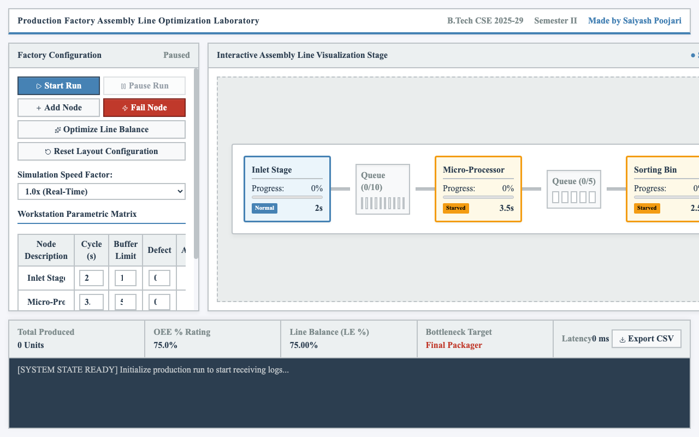

# Production Factory Assembly Line Optimization Laboratory

An interactive, real-time discrete event simulation laboratory dashboard designed to model, analyze, and optimize production factory assembly line operations.



## Key Features

- **Real-Time Interactive Assembly Line**: Visualizes workstations, buffers, queues, and moving items (tokens) with status indicators:
  - **Steel Blue (Normal/Processing)**: The machine is currently processing items.
  - **Amber (Starved)**: The machine is idle due to empty upstream stages.
  - **Crimson (Blocked)**: The machine is idle because the downstream staging buffer is full.
  - **Grey (Broken)**: The machine is currently undergoing repairs.
- **Factory Layout Customization**: Add new workstation nodes, edit workstation metrics (name, cycle times, buffer limits, defect rates), and delete nodes dynamically.
- **Analytics & Diagnostics (HUD)**:
  - **Total Produced Units**: The count of successfully finished products.
  - **Overall Equipment Effectiveness (OEE %)**: Availability × Performance × Quality.
  - **Line Balancing Efficiency (LE %)**: Efficiency rating calculated using task times.
  - **Bottleneck Target Identification**: Highlights the current system bottleneck stage in real-time.
- **Stochastic Failure Injections**: Simulate random machine breakdowns to test line resilience, or manually inject failures.
- **Line Balancing Heuristics**: Auto-optimize workstation cycle times evenly to match average processing capabilities.
- **Telemetry Export**: Export detailed system status logs to a CSV file.

## Technical Details

- **Framework**: React.js & Vite
- **Styling**: Vanilla CSS with professional light industrial control desk values
- **Icons**: Lucide React
- **Typography**: Times New Roman global profile

## Getting Started

### Prerequisites

- Node.js (v18 or higher)
- npm (Node Package Manager)

### Installation

1. Install dependencies:
   ```bash
   npm install
   ```

2. Start the development server:
   ```bash
   npm run dev
   ```

3. Open [http://localhost:5173](http://localhost:5173) in your browser.

## License

This project is licensed under the MIT License - see the [LICENSE](./LICENSE) file for details.
