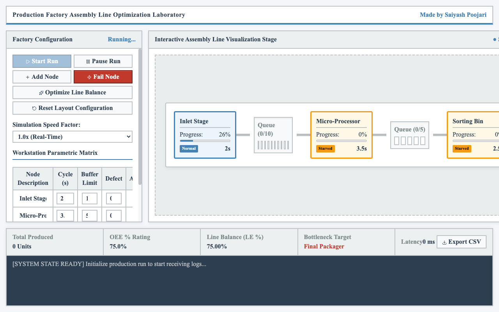
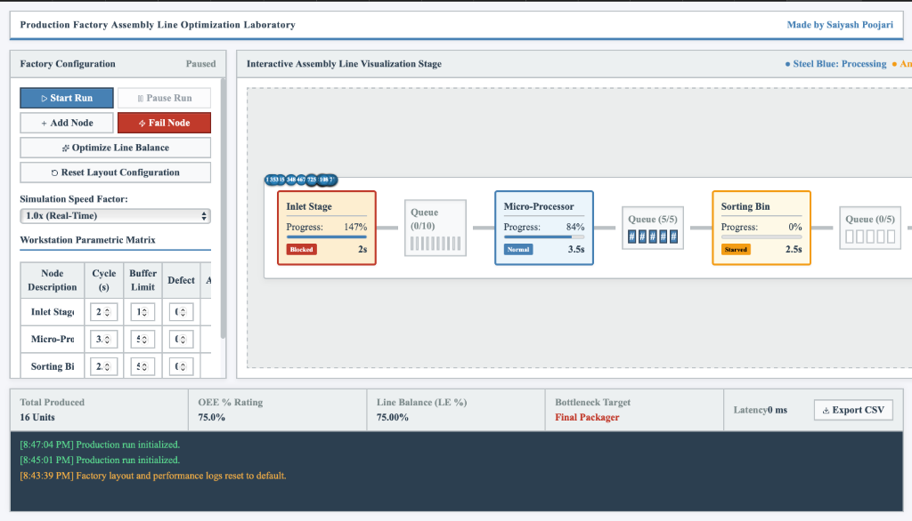

# Production Factory Assembly Line Optimization Laboratory

An interactive, real-time discrete event simulation laboratory dashboard designed to model, analyze, and optimize production factory assembly line operations.

## Active Simulation Run Preview

Here is the assembly line and real-time operational telemetry in action during a production run:

### 1. Initialization and Processing Staged Items


### 2. Workstation Status and Buffer Queue Scaling


### 3. Continuous Simulation Logs and Metric Stream


## Diagnostics HUD & Telemetry Logs

The bottom telemetry panel displays the real-time health, performance diagnostics, and system output logs:



- **Total Produced Units**: Tracks the total number of non-defective units successfully processed through all assembly stages.
- **OEE % Rating (Overall Equipment Effectiveness)**: Calculated using the product of availability (uptime ratio), performance (line efficiency), and quality (ratio of good units to total processed units).
- **Line Balance (LE %)**: Computes the assembly line balancing efficiency based on workstation cycle times, indicating how evenly tasks are distributed.
- **Bottleneck Target**: Identifies the slow-running workstation that is currently bottlenecking the throughput.
- **Latency & CSV Export**: Displays frame processing latency in milliseconds and offers a click-to-export functionality for downloading the full operational telemetry logs as a CSV.
- **Real-Time Terminal Logs**: An integrated logger displaying detailed timestamped event streams (e.g. production run initializations, workstation resets, defect alerts, and stochastic machine failures).

## Key Features

- **Real-Time Interactive Assembly Line**: Visualizes workstations, buffers, queues, and moving items (tokens) with status indicators:
  - **Steel Blue (Normal/Processing)**: The machine is currently processing items.
  - **Amber (Starved)**: The machine is idle due to empty upstream stages.
  - **Crimson (Blocked)**: The machine is idle because the downstream staging buffer is full.
  - **Grey (Broken)**: The machine is currently undergoing repairs.
- **Factory Layout Customization**: Add new workstation nodes, edit workstation metrics (name, cycle times, buffer limits, defect rates), and delete nodes dynamically.
- **Stochastic Failure Injections**: Simulate random machine breakdowns to test line resilience, or manually inject failures.
- **Line Balancing Heuristics**: Auto-optimize workstation cycle times evenly to match average processing capabilities.

## Technical Details

- **Framework**: React.js & Vite
- **Styling**: Vanilla CSS with professional light industrial control desk values
- **Icons**: Lucide React
- **Typography**: Times New Roman global profile

## Getting Started

### Prerequisites

- Node.js (v18 or higher)
- npm (Node Package Manager)

### Installation

1. Install dependencies:
   ```bash
   npm install
   ```

2. Start the development server:
   ```bash
   npm run dev
   ```

3. Open [http://localhost:5173](http://localhost:5173) in your browser.

## License

This project is licensed under the MIT License - see the [LICENSE](./LICENSE) file for details.
